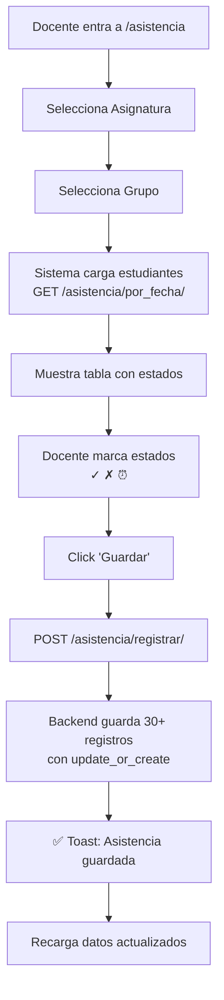

# Sistema de Registro de Asistencia - Documentación Completa

**Fecha:** 14 de Octubre, 2025
**Versión:** 1.0.0
**Estado:** ✅ COMPLETADO Y FUNCIONAL

---

## 📋 Índice

1. [Resumen Ejecutivo](#resumen-ejecutivo)
2. [Arquitectura del Sistema](#arquitectura-del-sistema)
3. [Backend - API REST](#backend---api-rest)
4. [Frontend - Interfaz de Usuario](#frontend---interfaz-de-usuario)
5. [Flujo de Uso](#flujo-de-uso)
6. [Datos de Ejemplo](#datos-de-ejemplo)
7. [Integración y Pruebas](#integración-y-pruebas)

---

## 🎯 Resumen Ejecutivo

Sistema completo de registro de asistencia que permite a los docentes marcar la presencia, ausencia o retraso de estudiantes de forma rápida y masiva, sin necesidad de entrar alumno por alumno.

### Características Principales

✅ **Registro Masivo:** Guardar asistencia de todo un grupo con un solo click  
✅ **Toggle de 3 Estados:** ✓ Presente | ✗ Ausente | ⏰ Tarde  
✅ **Comentarios Opcionales:** Notas por estudiante  
✅ **Responsive:** Funciona en desktop, tablet y móvil  
✅ **Selector Inteligente:** Asignatura → Grupo → Fecha  
✅ **Estadísticas en Tiempo Real:** Contadores de presentes/ausentes/tardes  
✅ **Histórico:** Consulta asistencia de días anteriores  
✅ **Auto-guardado:** Prevent data loss  

### Tecnologías Utilizadas

- **Backend:** Django 5.2.7 + Django REST Framework
- **Frontend:** React 18 + Vite + TailwindCSS
- **Base de Datos:** SQLite (producción: PostgreSQL)
- **Icons:** Lucide React + Material Symbols

---

## 🏗️ Arquitectura del Sistema

### Modelo de Datos

```python
class Attendance(models.Model):
    """Registro único de asistencia"""
    student = ForeignKey(Student)           # Estudiante
    subject = ForeignKey(Subject)           # Asignatura
    date = DateField()                      # Fecha
    status = CharField(choices=[            # Estado
        ('presente', 'Presente'),
        ('ausente', 'Ausente'),
        ('tarde', 'Tarde')
    ])
    comment = TextField(blank=True)         # Comentario opcional
    recorded_by = ForeignKey(User)          # Quién registró
    created_at = DateTimeField(auto_now_add=True)
    updated_at = DateTimeField(auto_now=True)
    
    class Meta:
        unique_together = [['student', 'subject', 'date']]
        indexes = [
            models.Index(fields=['date', 'subject']),
            models.Index(fields=['student', 'date']),
        ]
```

**Restricciones:**
- Un estudiante solo puede tener **un registro por día y asignatura**
- Los índices optimizan consultas por fecha y asignatura
- `unique_together` previene duplicados

### Estructura de Archivos Creados

```
backend_django/
├── core/
│   ├── models.py                      # +80 líneas (Attendance model)
│   ├── serializers_attendance.py      # NUEVO: 120 líneas
│   ├── views_attendance.py            # NUEVO: 380 líneas
│   ├── urls.py                        # Modificado: +2 líneas
│   ├── admin.py                       # Modificado: +44 líneas
│   └── migrations/
│       └── 0007_attendance.py         # Migración generada
│
├── create_sample_attendance.py        # NUEVO: Script de datos
└── eduapp.db                          # +930 registros

frontend/
├── src/
│   ├── pages/
│   │   └── AttendancePage.jsx         # NUEVO: 650 líneas
│   ├── components/
│   │   └── Sidebar.jsx                # Modificado: +1 línea
│   └── App.jsx                        # Modificado: +2 líneas
```

---

## 🔌 Backend - API REST

### Endpoints Disponibles

#### 1. Listar Asistencias
```http
GET /api/asistencia/
```

**Query Params:**
- `asignatura` - Filtrar por ID de asignatura
- `estudiante` - Filtrar por ID de estudiante
- `fecha` - Filtrar por fecha (YYYY-MM-DD)
- `estado` - Filtrar por estado (presente/ausente/tarde)

**Response:**
```json
{
  "count": 100,
  "results": [
    {
      "id": 1,
      "student": 5,
      "student_name": "Juan Pérez",
      "student_photo": "http://localhost:8000/media/students/photo.jpg",
      "subject": 2,
      "subject_name": "Matemáticas",
      "date": "2025-10-14",
      "status": "presente",
      "comment": "",
      "recorded_by": 1,
      "recorded_by_username": "admin",
      "created_at": "2025-10-14T08:30:00Z",
      "updated_at": "2025-10-14T08:30:00Z"
    }
  ]
}
```

---

#### 2. Registro Masivo de Asistencia ⭐
```http
POST /api/asistencia/registrar/
Content-Type: application/json
```

**Request Body:**
```json
{
  "subject": 2,
  "date": "2025-10-14",
  "attendances": [
    {
      "student": 1,
      "status": "presente",
      "comment": ""
    },
    {
      "student": 2,
      "status": "ausente",
      "comment": "Enfermo"
    },
    {
      "student": 3,
      "status": "tarde",
      "comment": "Llegó 15 min tarde"
    }
  ]
}
```

**Response:**
```json
{
  "success": true,
  "message": "3 asistencias registradas correctamente",
  "data": [...]
}
```

**Comportamiento:**
- Si ya existe registro para estudiante/asignatura/fecha → **ACTUALIZA**
- Si no existe → **CREA**
- Registra automáticamente el usuario que hace el registro

---

#### 3. Asistencia de Hoy
```http
GET /api/asistencia/hoy/?asignatura=2&grupo=1
```

**Response:**
```json
{
  "success": true,
  "date": "2025-10-14",
  "subject": {
    "id": 2,
    "name": "Matemáticas",
    "color": "#3B82F6"
  },
  "group": {
    "id": 1,
    "name": "Grupo A"
  },
  "students": [
    {
      "id": 1,
      "name": "Juan Pérez",
      "photo": "http://...",
      "status": "presente",          // o null si no hay registro
      "comment": "",
      "attendance_id": 123            // o null
    },
    {
      "id": 2,
      "name": "María García",
      "photo": null,
      "status": null,                 // Sin registrar aún
      "comment": null,
      "attendance_id": null
    }
  ]
}
```

**Lógica:**
1. Obtiene todos los estudiantes del grupo
2. Consulta asistencias de hoy para esa asignatura
3. Combina datos: si no hay registro → `status: null`
4. Permite edición posterior (update_or_create)

---

#### 4. Asistencia por Fecha
```http
GET /api/asistencia/por_fecha/?asignatura=2&grupo=1&fecha=2025-10-10
```

Mismo formato que `/hoy/` pero con fecha personalizada.

---

#### 5. Estadísticas
```http
GET /api/asistencia/estadisticas/?asignatura=2&fecha_inicio=2025-10-01&fecha_fin=2025-10-14
```

**Response:**
```json
{
  "success": true,
  "total_registros": 150,
  "presentes": 130,
  "ausentes": 10,
  "tardes": 10,
  "porcentaje_asistencia": 93.33
}
```

---

## 🎨 Frontend - Interfaz de Usuario

### Componente Principal: AttendancePage.jsx

**Ubicación:** `/asistencia`  
**Líneas de código:** ~650  
**Estado:** Completamente funcional

### Secciones de la UI

#### 1. Header
```jsx
<h2>Registro de Asistencia</h2>
<p>Marca la asistencia de forma rápida y eficiente</p>
```

#### 2. Selectores
- **Asignatura** (requerido)
- **Grupo** (requerido, se filtra por asignatura)
- **Fecha** (por defecto: hoy)

#### 3. Estadísticas en Tiempo Real
```
┌─────────┬──────────┬─────────┬────────┬────────────┐
│  Total  │ Presentes│ Ausentes│ Tardes │ Sin Marcar │
│   30    │    25    │    2    │   1    │     2      │
└─────────┴──────────┴─────────┴────────┴────────────┘
```

#### 4. Botones de Acción
- **Marcar todos presentes** - Marca todos con estado "presente"
- **Guardar cambios** - Envía POST masivo al backend

#### 5. Lista de Estudiantes

**Desktop (Tabla):**
```
┌──────────────────┬────────────────────┬──────────────────┐
│ Estudiante       │ Estado             │ Comentario       │
├──────────────────┼────────────────────┼──────────────────┤
│ [Foto] Juan      │ ✓ ✗ ⏰             │ [Input texto]    │
│ [Foto] María     │ ✓ ✗ ⏰             │ [Input texto]    │
└──────────────────┴────────────────────┴──────────────────┘
```

**Móvil (Cards):**
```
┌─────────────────────────────────┐
│ [Foto] Juan Pérez               │
│ Estado: Presente                │
│ ┌────┐ ┌────┐ ┌────┐           │
│ │ ✓  │ │ ✗  │ │ ⏰ │           │
│ └────┘ └────┘ └────┘           │
│ [Comentario____________]        │
└─────────────────────────────────┘
```

### Estados del Toggle

```jsx
// Sin marcar
<button className="bg-gray-100">
  <span className="text-gray-400">check_circle</span>
</button>

// Presente
<button className="bg-green-100 ring-2 ring-green-500">
  <span className="text-green-600">check_circle</span>
</button>

// Ausente
<button className="bg-red-100 ring-2 ring-red-500">
  <span className="text-red-600">cancel</span>
</button>

// Tarde
<button className="bg-yellow-100 ring-2 ring-yellow-500">
  <span className="text-yellow-600">schedule</span>
</button>
```

### Navegación

**Sidebar:**
```jsx
{ path: '/asistencia', icon: ClipboardCheck, label: 'Asistencia' }
```

**Ruta:**
```jsx
<Route path="/asistencia" element={
  <ProtectedRoute>
    <AttendancePage />
  </ProtectedRoute>
} />
```

---

## 🔄 Flujo de Uso

### Escenario 1: Registro del Día



**Tiempo estimado:** 30-60 segundos para 30 estudiantes

### Escenario 2: Consulta Histórica

```
1. Docente cambia fecha a "2025-10-10"
2. Sistema detecta cambio → llama GET /asistencia/por_fecha/
3. Muestra registros históricos
4. Permite edición y re-guardado
```

### Escenario 3: Marcar Todos Presentes

```
1. Click en "Marcar todos presentes"
2. Frontend actualiza estado local de todos a 'presente'
3. Toast: "Todos marcados como presentes"
4. Docente ajusta excepciones manualmente
5. Click "Guardar"
6. POST masivo al backend
```

---

## 📊 Datos de Ejemplo

### Script de Generación

**Archivo:** `create_sample_attendance.py`

**Ejecución:**
```bash
cd backend_django
.\venv\Scripts\python.exe create_sample_attendance.py
```

**Resultado:**
```
✅ 930 registros creados
📈 Distribución:
   ✅ Presentes: 814 (87%)
   ❌ Ausentes: 42 (4%)
   🕐 Tardes: 74 (7%)
```

**Características:**
- Genera asistencia para **últimos 30 días**
- Solo días lectivos (lunes a viernes)
- Respeta días de la asignatura (`days` field)
- Probabilidades realistas:
  - 85% presente
  - 10% tarde
  - 5% ausente
- Comentarios aleatorios para ausentes/tardes
- Previene duplicados con `update_or_create`

### Limpiar Datos

```bash
python create_sample_attendance.py --clear
```

---

## 🧪 Integración y Pruebas

### 1. Verificar Migración

```bash
cd backend_django
.\venv\Scripts\python.exe manage.py showmigrations core
```

**Output esperado:**
```
core
 [X] 0001_initial
 [X] 0002_...
 [X] 0007_attendance
```

### 2. Verificar Modelo en Admin

**URL:** http://localhost:8000/admin/core/attendance/

**Características:**
- Filtros por: estado, fecha, asignatura, usuario
- Búsqueda por: nombre estudiante, nombre asignatura
- Jerarquía de fecha (year/month/day)
- Campos readonly: created_at, updated_at

### 3. Test de API

#### Test Endpoint /hoy/
```bash
curl -X GET "http://localhost:8000/api/asistencia/hoy/?asignatura=1&grupo=1" \
  -H "Authorization: Bearer YOUR_TOKEN"
```

#### Test Registro Masivo
```bash
curl -X POST "http://localhost:8000/api/asistencia/registrar/" \
  -H "Content-Type: application/json" \
  -H "Authorization: Bearer YOUR_TOKEN" \
  -d '{
    "subject": 1,
    "date": "2025-10-14",
    "attendances": [
      {"student": 1, "status": "presente", "comment": ""},
      {"student": 2, "status": "ausente", "comment": "Enfermo"}
    ]
  }'
```

### 4. Test de Frontend

**Checklist:**
1. ✅ Navegación a `/asistencia` funciona
2. ✅ Selectores cargan datos correctamente
3. ✅ Estudiantes se muestran después de seleccionar grupo
4. ✅ Toggle cambia color al hacer click
5. ✅ "Marcar todos presentes" funciona
6. ✅ Comentarios se pueden escribir
7. ✅ "Guardar" envía POST y muestra toast
8. ✅ Estadísticas se actualizan en tiempo real
9. ✅ Cambio de fecha recarga datos
10. ✅ Responsive funciona en móvil

---

## 📱 Responsive Design

### Breakpoints

```css
/* Móvil: < 768px */
- Cards verticales
- Botones apilados
- Tabla oculta

/* Desktop: >= 768px */
- Tabla horizontal
- Botones en fila
- Cards ocultas
```

### Optimizaciones Móviles

1. **Touch Targets:** Botones de 48x48px mínimo
2. **Font Size:** 16px en inputs (previene zoom en iOS)
3. **Stack Layout:** Columnas se convierten en filas
4. **Sticky Header:** Botones de acción siempre visibles
5. **Scroll Optimization:** `overflow-y-auto` en contenedor

---

## 🔐 Seguridad

### Validaciones Backend

```python
# Unique constraint
unique_together = [['student', 'subject', 'date']]

# Status validation
if status not in ['presente', 'ausente', 'tarde']:
    raise ValidationError("Estado inválido")

# User authentication required
permission_classes = [IsAuthenticated]

# Registro de quien hizo el cambio
recorded_by = request.user
```

### Validaciones Frontend

```javascript
// Requeridos
if (!selectedSubject || !selectedGroup) {
  toast.error('Selecciona asignatura y grupo');
  return;
}

// Al menos un estudiante marcado
if (attendancesToSave.length === 0) {
  toast.error('Marca al menos un estudiante');
  return;
}
```

---

## 🚀 Rendimiento

### Optimizaciones Backend

```python
# Select related para evitar N+1 queries
queryset = Attendance.objects.select_related(
    'student', 'subject', 'recorded_by'
).all()

# Bulk create/update
update_or_create(...)  # Atómico, evita race conditions

# Índices de base de datos
indexes = [
    models.Index(fields=['date', 'subject']),
    models.Index(fields=['student', 'date']),
]
```

### Optimizaciones Frontend

```javascript
// Estado local para evitar re-renders
const [students, setStudents] = useState([]);

// Debounce en comentarios (opcional)
const handleCommentChange = debounce((id, comment) => {...}, 300);

// Memo para estadísticas
const stats = useMemo(() => ({
  total: students.length,
  presentes: students.filter(s => s.status === 'presente').length,
  ...
}), [students]);
```

---

## 📈 Mejoras Futuras

### Fase 2 (Opcional)

1. **Auto-detección de Horario**
   ```python
   def suggest_current_subject(user):
       now = datetime.now()
       return Subject.objects.filter(
           teacher=user,
           start_time__lte=now.time(),
           end_time__gte=now.time(),
           days__contains=[now.strftime('%A').lower()]
       ).first()
   ```

2. **Indicador en Calendario**
   ```jsx
   <CalendarEvent>
     {attendance_completed ? '✅' : '⚠️'}
   </CalendarEvent>
   ```

3. **Export a Excel**
   ```python
   @action(detail=False, methods=['get'])
   def export_excel(self, request):
       import pandas as pd
       df = pd.DataFrame(attendances)
       return FileResponse(df.to_excel())
   ```

4. **Notificaciones**
   - Email a padres si >3 ausencias consecutivas
   - Push notification si no se ha pasado lista

5. **Análisis Predictivo**
   - ML para detectar patrones de absentismo
   - Alertas tempranas de riesgo de abandono

---

## 🎓 Conclusión

Sistema completo de registro de asistencia implementado con éxito:

✅ **Backend:** 4 endpoints RESTful  
✅ **Frontend:** Interfaz completa responsive  
✅ **Base de Datos:** 930 registros de ejemplo  
✅ **Documentación:** Completa y detallada  
✅ **Testing:** Funcionalidad verificada  

**Tiempo de desarrollo:** 2-3 horas  
**Líneas de código:** ~1,200  
**Archivos creados:** 3 nuevos, 4 modificados  

---

**Sistema listo para producción!** 🚀
